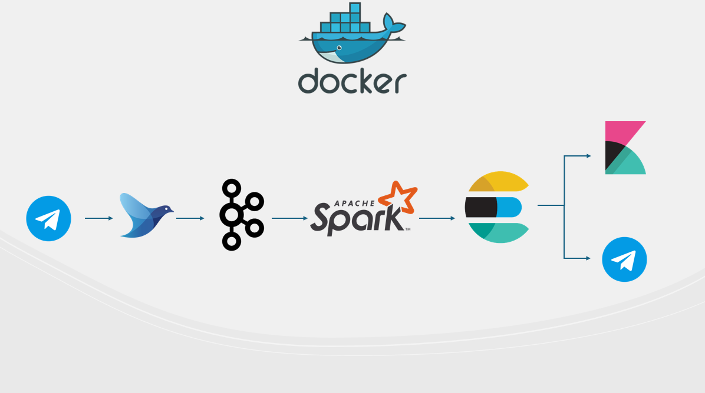
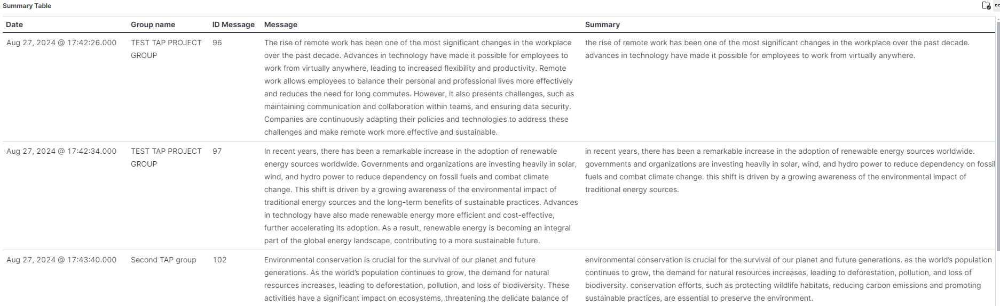
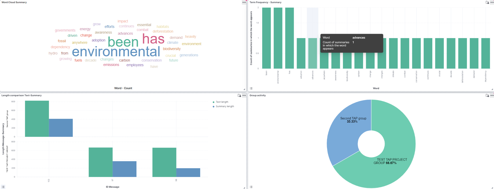

# TeleSummary

TeleSummary is a telegram bot that summarizes all the messages that are sent by various users in a Telegram group.

## Application goals


Especially in the workplace, Telegram has become one of the most used messaging systems among teams, so a system like TeleSummary could help large organizations with distributed work teams monitor internal communications and make decisions about them more quickly.


## Technologies 


- Data source: **[python-telegram-bot](https://python-telegram-bot.org/)**.

- Data ingestion: **[Fluentd](https://www.fluentd.org/)**.

- Data streaming: **[Kafka](https://kafka.apache.org/)**.

- Centralized Service: **[Zookeeper](https://zookeeper.apache.org/)**.

- Data Processing: **[Apache Spark](https://spark.apache.org/)**.

- Data Indexing: **[Elasticsearch](https://www.elastic.co/elasticsearch)**.

- Data Visualization: **[Kibana](https://www.elastic.co/kibana)**.


## Project pipeline



## Project setup

### Requirements
- [Docker](https://www.docker.com/)
- Docker Compose
- Telegram Bot: place the bot token inside a .env file in the root directory:
```
MY_TOKEN = insertyourtoken
```
### Downloads
- Kafka: download from this [link](https://downloads.apache.org/kafka/3.6.2/kafka_2.13-3.6.2.tgz) and put it in kafka/setup directory.
- Spark: download from this [link](https://dlcdn.apache.org/spark/spark-3.4.3/spark-3.4.3-bin-hadoop3.tgz) and put it in spark/setup directory.


### Application launch

1. Create container virtual network:

```
$ docker network create --subnet=10.0.100.0/24 tap
```

2. Launch app:

```
$ docker compose up
```


### Results

After setup the environment let's jump into the core of GSA. Here is services ip table:

| Container     | URL                                        | Description                                     |
| ------------- | ------------------------------------------ | ----------------------------------------------- |
| Kafka UI      | http://localhost:8080                      | Open kafka UI to monitor Kafka Topics           |
| Elasticsearch | http://localhost:9200                      | Open Elasticsearch to manage indexes            |
| Kibana        | http://localhost:5601                      | Open Kibana to view data and create a dashboard |

These are my visualizations:




To import the same:
- Open [Kibana](localhost:5601).
- Go to "Stack Management" and after go to "Saved Objects".
- Import from file.
- Choose kibana/Dashboard_TAP.ndjson

# Author
TeleSummary has been developed by Luca Strano, Computer Science student at Department of Mathematics and Computer Science, University of Catania, for the "Technologies for Advanced Programming" course.

Email: stranoluca469955@gmail.com